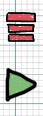
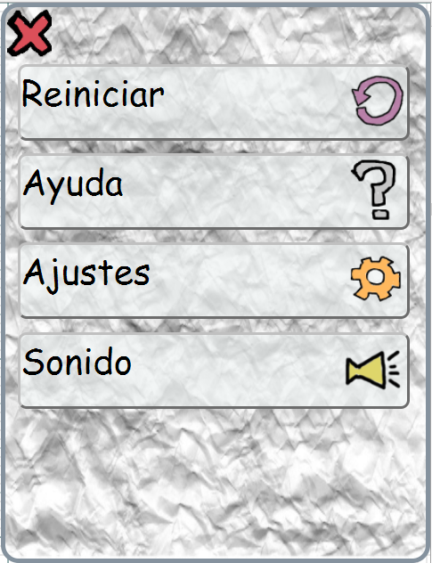
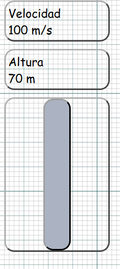
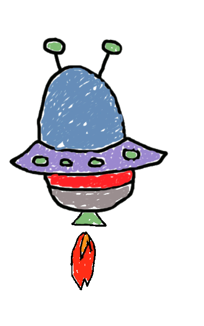

# Lunar lander con html, css y javascript

Juego terminado: https://rawgit.com/ach74/LunaLander-Ach74/master/index.html

**Autor:** Achraf El Ouakili

**Asignatura:** Lenguaje de marcas

## PROYECTO:

El objetivo final de este proyecto es desarollar un juego, en que una nave tiene que aterrizar en la luna, este mismo sera creado esteticamente con HTML y CSS. El desplazamiento de la nave y las funciones de los paneles de control estaran definidos en el JavaScript.
El proyecto que he decidido desarollar ha sido el que diseñe al principio de este proyecto, pero añadiendo algunas modificaciones.

Este es el resultado final para la version de ordenador:
  

Y este es el resultado final para la version para mobiles:
  

## Explicacion:

### Botones de la version para ordenador:

Como se puede observar en la version para ordenadores tenemos una serie de opciones para interactuar con el juego:
  

* El primer boton siruado mas a la izquierda, es el de sonido. Una vez pulsado sonara una melodia que nos acompañara mientras jugamos.Por defecto el juego viene silenciado. Cuando pulsemos este boton tambien cambiara. Y pasaremos a tener otro que nos permitira silenciar el juego.
Los botones que iran intercambiando entre si son los siguientes:

 
 

* El siguiente es el de reinicio, con el podremos volver a empezar cuando queramos.

* A continuacion viene el boton encargado de pausar el juego o ponerlo en marcha. Este boton ira alternando entre los dos estado segun lo pulsemos. Por defecto viene en pausa.

 
 

* El boton que veremos a continuacion es el boton de "Ayuda" que nos abrira una pestaña donde nos explicara el juego.Panel que abrira es el siguiente:

 

Como podemos observar hay un boton el de "About" si le damos nos llevara a otra pagina donde nos ablaran un poco mas del juego.

* Por ultimo tenemos el boton de "Ajustes", el cual una vez desplegado nos mostrara las siguientes funciones:
 

Como se muestra podremos cambiar la dificultat y la nave solo con hacer click. Al cambiar la nave, lo que se hace es ocultar la imagen de la nave que se esta mostrando, para poner en visible la que esta oculta. Y asi sucesivamente. Las nave con las cuales podremos jugar son las siguientes:

 
 

Si lo que queremos es cambiar la dificultat del juego, solo con elegir una de las opciones que se nos muestra vastara. Dependiendo el nivel de dificultat que eligamos el valor que influye sobre la gravedad aumentara o disminuira.

### Botones de la version para movil:

Para la version movil tenemos menos botones en pantalla, un total de 2:

* El boton rojo, es el encargado de recoger todos los demas botones que teniamos en la version para ordenador. Una vez le demos se nos mostraran la mismas opciones que teniemos para ordenador pero recogidas en un recuadro que se mantiene oculto cuendo jugamos.

El panel que se nos va a desplegas es el siguiente:

Como podemos obsevar tenemos las mismas opciones que teniamos en la version de escritorio, con lo cual hacen las mismas funciones.

* El boton verde (Pause) hace lo mismo que en la version de escritorio. Controlar si el juego para detenerlo o no.

### Indicadores:

En las dos versiones tenemos los mismos indicadores solo que en kla version para moviles, la anchura se hace un poco mas pequena. Los indicadores son los siguientes :

* El indicador de velocidad nos marcara a que velocidad estamos cayendo, o por su contrario ascendidiendo.

* El indicador de altura nos marcara cuenta distancia estamos cayendo.

* El siguiente es el indicador de fuel, que mediante una barra vertical nos mostrara cuanta gasolina nos queda en el tanque de gasolina.

### Otros elementos:

* Cuando interactuemeos con algun elemnto que nos vaya a mostrar informacion o mas opciones, como por ejemplo la opcion de "Ayuda", tenemos un boton situado en la parte superior izquierda, que nos permite volver atras, o mas bien hacer que desaparesca el elemto que hemos abierto.

El boton es el siguiente:

* Otro boton muy importante es el boton para propulsar la nave, en este caso tiene aspecto de palanca, y solo propulsa la nave cuando estoms pulsando en el. Este boton se mantiene automaticamente apagado cuendo no es usado o cuando el juego a finalizado. Ademas de que cambia de aspecto segun lo pulsemos o no.

Aqui le muestro sus dos estados:

## Inicio del juego

Una vez iniciemos el juego la nave ira descendiendo dependiendo de la dificultat elegida. Y para controlar dicho descenso tenemos el boton de propulsion que cada ver que lo pulsemo la imagen de la nave cambiara a un gif, que nos dara la imprecion de que esta desprenssiedo fuego. Dichos gif son lo siguientes:

 
 

