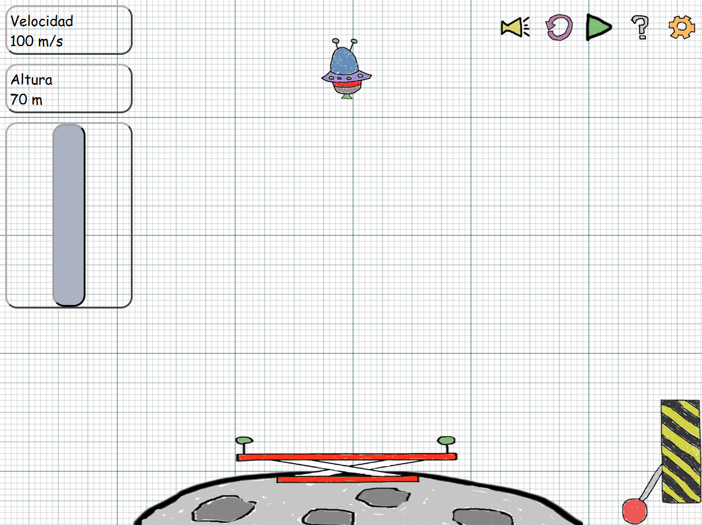
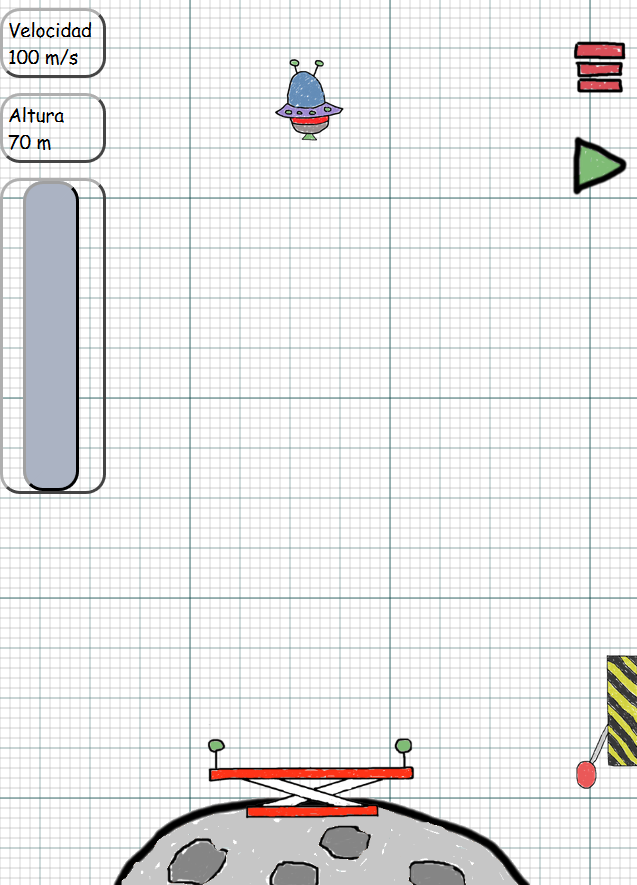
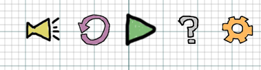
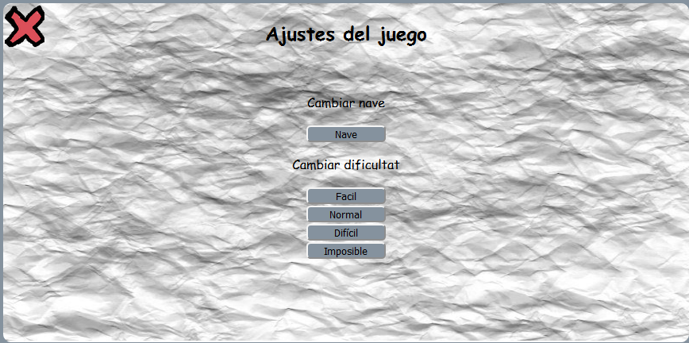
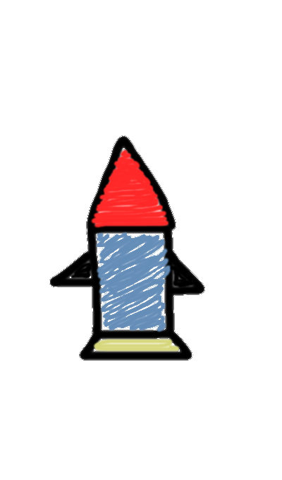
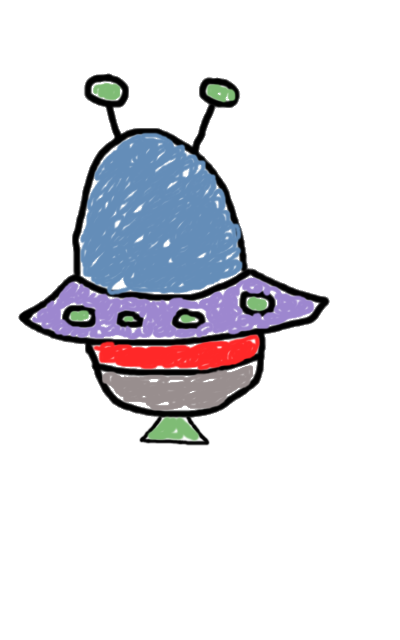

# Lunar lander con html, css y javascript

Juego terminado: https://rawgit.com/ach74/LunaLander-Ach74/master/index.html

**Autor:** Achraf El Ouakili

**Asignatura:** Lenguaje de marcas

## PROYECTO:

El objetivo final de este proyecto es desarollar un juego, en que una nave tiene que aterrizar en la luna, este mismo sera creado esteticamente con HTML y CSS. El desplazamiento de la nave y las funciones de los paneles de control estaran definidos en el JavaScript.
El proyecto que he decidido desarollar ha sido el que diseñe al principio de este proyecto, pero añadiendo algunas modificaciones.

Este es el resultado final para la version de ordenador:
  

Y este es el resultado final para la version para mobiles:
  

### Explicacion:

Como se puede observar en la version para ordenadores tenemos una serie de opciones para interactuar con el juego:
  

* El primer boton siruado mas a la izquierda, es el de sonido. Una vez pulsado sonara una melodia que nos acompañara mientras jugamos.Por defecto el juego viene silenciado. Cuando pulsemos este boton tambien cambiara. Y pasaremos a tener otro que nos permitira silenciar el juego.
Los botones que iran intercambiando entre si son los siguientes:

 
 

* El siguiente es el de reinicio, con el podremos volver a empezar cuando queramos.

* A continuacion viene el boton encargado de pausar el juego o ponerlo en marcha. Este boton ira alternando entre los dos estado segun lo pulsemos. Por defecto viene en pausa.

 
 

* El boton que veremos a continuacion es el boton de "Ayuda" que nos abrira una pestaña donde nos explicara el juego.Panel que abrira es el siguiente:

 

Como podemos observar hay un boton el de "About" si le damos nos llevara a otra pagina donde nos ablaran un poco mas del juego.

* Por ultimo tenemos el boton de "Ajustes", el cual una vez desplegado nos mostrara las siguientes funciones:
 

Como se muestra podremos cambiar la dificultat y la nave solo con hacer click. Al cambiar la nave, lo que se hace es ocultar la imagen de la nave que se esta mostrando, para poner en visible la que esta oculta. Y asi sucesivamente. Las nave con las cuales podremos jugar son las siguientes:

 
 

Si lo que queremos es cambiar la dificultat del juego, solo con elegir una de las opciones que se nos muestra vastara. Dependiendo el nivel de dificultat que eligamos el valor que influye sobre la gravedad aumentara o disminuira.

## Iniciar el juego:

Para poder empezar a jugar lo que deberemos hacer es darle al Play, una vez le 

